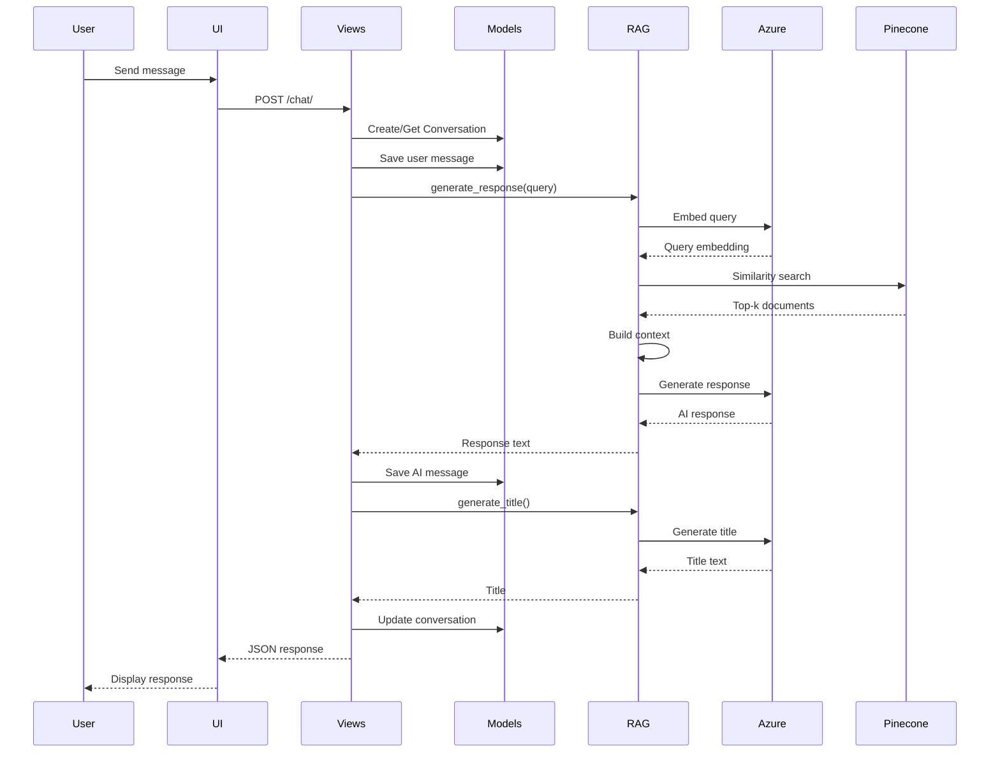

# Architecture Documentation

This document provides a detailed overview of the RAG Chatbot system architecture, design decisions, and technical implementation.

## Table of Contents

- [System Overview](#system-overview)
- [High-Level Architecture](#high-level-architecture)
- [Component Breakdown](#component-breakdown)
- [Data Flow](#data-flow)
- [Database Schema](#database-schema)
- [RAG Pipeline](#rag-pipeline)
- [Design Decisions](#design-decisions)
- [Scalability Considerations](#scalability-considerations)

## System Overview

The RAG Chatbot is a Django-based web application that implements Retrieval-Augmented Generation (RAG) to provide intelligent, context-aware responses based on uploaded documents. The system combines:

- **Django Backend**: Handles HTTP requests, database operations, and business logic
- **Azure OpenAI**: Provides LLM capabilities for chat and embeddings
- **Pinecone**: Serverless vector database for efficient similarity search
- **MySQL**: Relational database for conversation and message storage

## High-Level Architecture


## Component Breakdown

### 1. Frontend (Chat Interface)

**Location**: `chat/templates/chat/chat.html`

**Responsibilities**:
- Render chat UI with message history
- Handle user input and file uploads
- Display conversation list in sidebar
- Manage conversation state and navigation
- Make AJAX requests to backend API

**Key Features**:
- Real-time message display
- Document upload interface
- Conversation management (create, load, delete)
- Responsive design

### 2. Django Backend

#### Views Layer

**Location**: `chat/views.py`

**Key Functions**:

| Function | Purpose |
|----------|---------|
| `chat_view()` | Main entry point, handles both GET (render UI) and POST (send message) |
| `upload_document()` | Processes document uploads and triggers ingestion |
| `get_conversations()` | Returns list of all conversations |
| `get_messages()` | Returns messages for a specific conversation |
| `delete_conversation()` | Deletes a conversation and its messages |

**Request Flow**:
1. Receive HTTP request
2. Validate input data
3. Interact with models (database)
4. Call RAG service for AI operations
5. Return JSON response or render template

#### Models Layer

**Location**: `chat/models.py`

**Database Models**:

```python
Conversation
├── id (PK)
├── title
├── created_at
└── updated_at

Message
├── id (PK)
├── conversation_id (FK)
├── role (user/ai)
├── content
└── created_at

Document
├── id (PK)
├── title
├── file_path
├── uploaded_at
└── processed
```

### 3. RAG Service

**Location**: `chat/rag_service.py`

**Core Class**: `RAGService`

**Responsibilities**:
- Initialize Azure OpenAI and Pinecone clients
- Process and embed documents
- Perform similarity search
- Generate AI responses
- Generate conversation titles

**Key Methods**:

| Method | Purpose |
|--------|---------|
| `__init__()` | Initialize Azure OpenAI and Pinecone connections |
| `ingest_file()` | Load, chunk, embed, and store documents |
| `generate_response()` | Retrieve context and generate AI response |
| `generate_title()` | Create conversation title using GPT |

### 4. External Services

#### Azure OpenAI

**Purpose**: Provides LLM and embedding capabilities

**Components**:
- **Chat Model** (`AzureChatOpenAI`): Generates conversational responses
- **Embedding Model** (`AzureOpenAIEmbeddings`): Creates 1024-dimensional vector embeddings

**Configuration**:
```python
embeddings = AzureOpenAIEmbeddings(
    azure_endpoint=AZURE_OPENAI_ENDPOINT,
    api_key=AZURE_OPENAI_API_KEY,
    api_version="2024-02-15-preview",
    azure_deployment=AZURE_EMBEDDING_DEPLOYMENT,
    dimensions=1024
)

llm = AzureChatOpenAI(
    azure_endpoint=AZURE_OPENAI_ENDPOINT,
    api_key=AZURE_OPENAI_API_KEY,
    api_version="2024-02-15-preview",
    azure_deployment=AZURE_CHAT_DEPLOYMENT,
    temperature=0.7
)
```

#### Pinecone Vector Database

**Purpose**: Stores and retrieves document embeddings

**Configuration**:
- **Dimensions**: 1024 (matches embedding model)
- **Metric**: Cosine similarity
- **Type**: Serverless index

**Operations**:
- `upsert()`: Store document embeddings with metadata
- `query()`: Retrieve top-k similar documents

## Data Flow

### Document Upload Flow


### Chat Message Flow



### Conversation Loading Flow


## Database Schema


**Relationships**:
- One conversation has many messages (1:N)
- Documents are independent (no direct relationship to conversations)

**Indexes**:
- `conversation_id` in Message table (for efficient message retrieval)
- `created_at` and `updated_at` in Conversation table (for sorting)

## RAG Pipeline

### 1. Document Ingestion


**Process**:
1. **Load**: Use PyPDFLoader or TextLoader based on file type
2. **Split**: RecursiveCharacterTextSplitter with 1000 char chunks, 200 char overlap
3. **Embed**: Azure OpenAI creates 1024-dimensional vectors
4. **Store**: Upsert to Pinecone with metadata (text, source)

**Chunk Strategy**:
- **Size**: 1000 characters (balances context and precision)
- **Overlap**: 200 characters (preserves context across boundaries)
- **Splitter**: Recursive (respects document structure)

### 2. Query Processing


**Process**:
1. **Embed**: Convert query to 1024-dimensional vector
2. **Search**: Cosine similarity search in Pinecone
3. **Retrieve**: Get top 3 most similar chunks
4. **Context**: Extract text from metadata
5. **Prompt**: Combine context + query with system message
6. **Generate**: Azure OpenAI generates response

**Retrieval Parameters**:
- **top_k**: 3 (balance between context and token limits)
- **Metric**: Cosine similarity
- **Include metadata**: True (to get original text)

### 3. Response Generation

**System Prompt** (French):
```
Tu es un assistant professionnel et précis.
Réponds de manière claire, structurée et complète, uniquement en texte simple.
Ne mets pas de gras, pas de titres en Markdown, pas d'étoiles, ni de symboles spéciaux.
Chaque fois que tu utilises un tiret pour lister des éléments, commence une nouvelle ligne après le tiret.
Utilise des paragraphes et phrases lisibles pour un style professionnel.
```

**Prompt Template**:
```
Contexte:
{retrieved_context}

Question: {user_query}
```

**Temperature**: 0.7 (balanced creativity and consistency)

### 4. Title Generation

**Purpose**: Auto-generate conversation titles using GPT

**System Prompt**:
```
Tu es un expert en synthèse. Génère un titre très court (max 5-6 mots) 
et professionnel pour cette conversation. Ne mets pas de guillemets, 
pas de point final.
```

**Input**: First user message + AI response

**Fallback**: If generation fails, use first 30 characters of user message

## Design Decisions

### 1. Why Django?

**Pros**:
- Built-in ORM for database management
- Robust authentication and security features
- Template system for frontend rendering
- Large ecosystem and community support

**Cons**:
- Heavier than Flask for simple APIs
- Monolithic structure

**Decision**: Django provides a complete framework suitable for a full-featured chatbot with user management potential.

### 2. Why Azure OpenAI over OpenAI?

**Pros**:
- Enterprise-grade security and compliance
- Data residency options
- Integration with Azure ecosystem
- SLA guarantees

**Cons**:
- More complex setup
- Potentially higher cost

**Decision**: Azure OpenAI offers better security and compliance for production use.

### 3. Why Pinecone over FAISS?

**Pros**:
- Serverless (no infrastructure management)
- Scalable to billions of vectors
- Built-in metadata filtering
- Managed service with high availability

**Cons**:
- External dependency
- Cost for large-scale usage

**Decision**: Pinecone simplifies deployment and scaling compared to self-hosted FAISS.

### 4. Why MySQL over PostgreSQL?

**Current**: MySQL is used

**Consideration**: PostgreSQL offers better JSON support and full-text search

**Recommendation**: Consider migrating to PostgreSQL for:
- Better JSON handling for metadata
- Built-in vector extensions (pgvector) as Pinecone alternative
- More advanced indexing capabilities

### 5. Singleton RAG Service

**Implementation**: `rag_service = RAGService()` at module level

**Pros**:
- Single connection pool to Azure and Pinecone
- Reduced initialization overhead
- Shared state across requests

**Cons**:
- Not thread-safe for concurrent writes
- Harder to test

**Recommendation**: For production, consider dependency injection or connection pooling.

## Scalability Considerations

### Current Limitations

1. **Single Server**: No horizontal scaling
2. **Synchronous Processing**: Document upload blocks request
3. **No Caching**: Every query hits Pinecone and Azure
4. **No Rate Limiting**: Vulnerable to abuse

### Scaling Strategies

#### 1. Asynchronous Processing

**Problem**: Document upload blocks HTTP request

**Solution**: Use Celery for background tasks

```python
@celery_app.task
def ingest_document_async(file_path):
    rag_service.ingest_file(file_path)
```

#### 2. Response Caching

**Problem**: Identical queries hit Azure OpenAI repeatedly

**Solution**: Implement Redis caching

```python
cache_key = f"response:{hash(query)}"
cached = redis.get(cache_key)
if cached:
    return cached
response = rag_service.generate_response(query)
redis.setex(cache_key, 3600, response)
```

#### 3. Load Balancing

**Problem**: Single server bottleneck

**Solution**: Deploy multiple Django instances behind Nginx

```
[Nginx Load Balancer]
    ├── Django Instance 1
    ├── Django Instance 2
    └── Django Instance 3
```

#### 4. Database Optimization

**Recommendations**:
- Add indexes on frequently queried fields
- Use database connection pooling
- Implement read replicas for conversation queries
- Archive old conversations

#### 5. Vector Database Optimization

**Recommendations**:
- Use namespaces in Pinecone for multi-tenancy
- Implement metadata filtering for user-specific documents
- Consider hybrid search (vector + keyword)

### Performance Metrics

**Target Latencies**:
- Document upload: < 30 seconds (async)
- Chat response: < 3 seconds
- Conversation load: < 500ms
- Message history: < 200ms

**Monitoring**:
- Azure OpenAI API latency
- Pinecone query time
- Database query performance
- Request throughput

## Future Improvements

1. **User Authentication**: Add user accounts and permissions
2. **Multi-tenancy**: Isolate documents per user
3. **Streaming Responses**: Real-time token streaming from GPT
4. **Advanced RAG**: Implement re-ranking, hybrid search
5. **Analytics**: Track usage, popular queries, response quality
6. **Export**: Allow conversation export (PDF, JSON)
7. **Voice Input**: Add speech-to-text capabilities
8. **Mobile App**: Native iOS/Android applications

## Security Considerations

1. **API Keys**: Never commit `.env` to version control
2. **CSRF Protection**: Enabled by default in Django
3. **Input Validation**: Sanitize user input before processing
4. **File Upload**: Validate file types and sizes
5. **Rate Limiting**: Implement to prevent abuse
6. **SQL Injection**: Use Django ORM (parameterized queries)
7. **XSS Protection**: Django templates auto-escape by default

---

For API details, see [API.md](API.md). For setup instructions, see [SETUP.md](SETUP.md).
